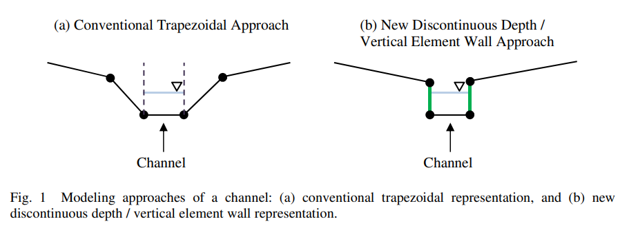
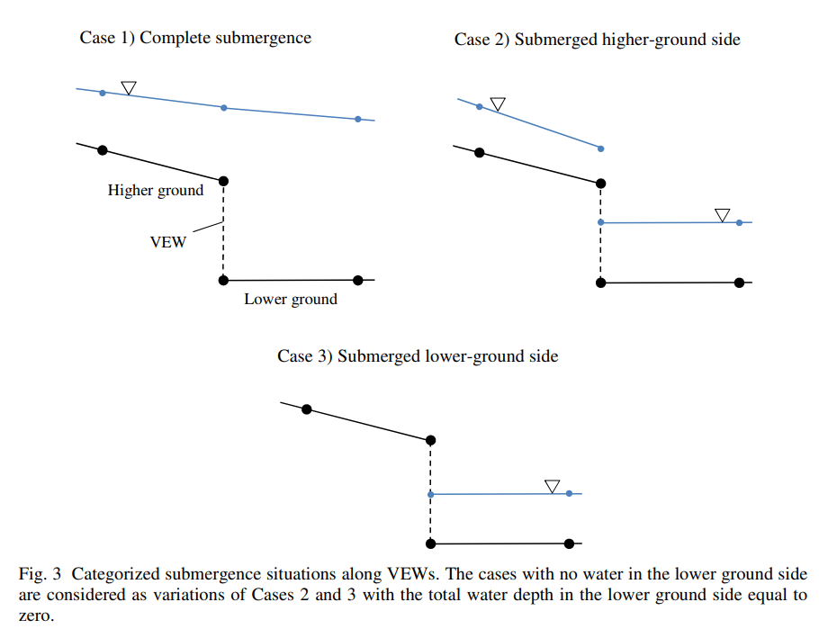
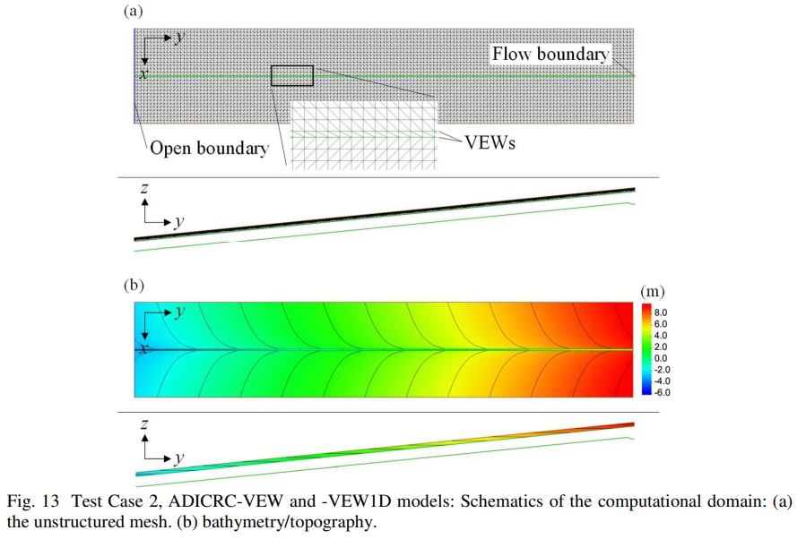
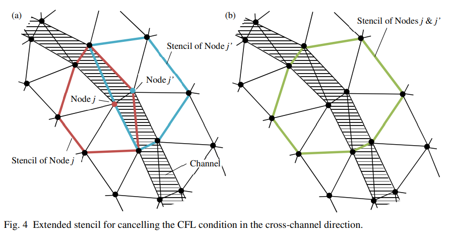

.. _special_features_vertical_element_walls:

Vertical Element Walls (VEWs)
=============================

What are Vertical Element Walls?
--------------------------------

Vertical Element Walls (VEWs) are a special boundary condition in ADCIRC that allow for the representation of steep-sided channels or other vertical features within the mesh. Unlike traditional mesh elements that assume a gradually sloping bathymetry, VEWs provide a way to model abrupt vertical changes in the terrain, which is particularly useful for:

1. Modeling narrow channels with vertical walls where traditional mesh elements would require excessive refinement, 
2. Representing steep slopes or embankments without the need for complex mesh transitions, and thus,
3. Simulating compound flooding scenarios involving river channels and floodplains

VEWs effectively create internal boundaries that allow water to flow between adjacent elements with different bed elevations, providing a more effective representation of channelized flow while maintaining computational efficiency.

.. note::
   VEWs and the :ref:`condensed_nodes` nodal attribute are implemented only for :ref:`IM` values that run ADCIRC in the lumped explicit mode.

   Schematic comparison of traditional trapezoidal channel representation (left) and vertical element wall approach (right). 

   Water in a channel and on a floodplain seamlessly interact through vertical element walls under various flow conditions, including normal flow, overtopping, and flooding scenarios.

Example Usages
--------------

Modeling Channels with Vertical Element Walls
~~~~~~~~~~~~~~~~~~~~~~~~~~~~~~~~~~~~~~~~~~~~~

VEWs are particularly useful for modeling narrow channels with floodplains modeled with a relatively large elements, not having a sufficient resolution to reprent channel side slopes properly. By using vertical walls to represent the channel sides:

* The channel can be represented at its true width without excessive mesh refinement
* Horizontal flow exchange between the channel and floodplain is accurately captured
* Computational efficiency is improved compared to traditional sloping-sided channel representations

This approach is valuable in scenarios such as compound flooding and intracoastal waterways where interaction between channels and floodplains is important and/or channels' side slopes are steep due to dredging.

Modeling One-sided Steep Slopes with Vertical Element Walls
~~~~~~~~~~~~~~~~~~~~~~~~~~~~~~~~~~~~~~~~~~~~~~~~~~~~~~~~~~~

For areas with significant elevation changes over short distances (such as sheet piles and dune fronts), VEWs provide an efficient alternative to dense mesh refinement:

* Sharp elevation transitions can be represented without mesh distortion
* Flow processes at these transitions (like overtopping) are more accurately modeled
* Computational requirements are reduced compared to fully-resolved sloping meshes

Special Features for VEW Channels with Condensed Nodes
------------------------------------------------------

ADCIRC includes several special features for more accurate modeling of VEW channels:

.. _wet_perimeter_consideration:

Wet Perimeter Consideration
   For channels modeled with both vertical element walls and :ref:`condensed_nodes` nodal attribute, ADCIRC can account for the wet perimeter in calculating bottom friction. This is activated through the VEW1DChannelControl namelist:

   .. code-block:: fortran

      &VEW1DChannelControl
         activateVEW1DChannelWetPerimeter = .true.
      /

   When enabled, this feature calculates the friction based on the rectangular cross-section of the channel, accounting for both the bed and the vertical walls in the total wetted perimeter. This provides more accurate representation of channel hydraulics, especially for narrow, deep channels.

.. _1d_channel:

Quasi 1D Solution with Rotated Flow Along Flowline
   For channels modeled with both vertical element walls and :ref:`condensed_nodes` nodal attribute, ADCIRC includes special handling of velocity components to ensure proper flow direction along the walls when they are not submerged. This prevents unrealistic cross-wall flow and maintains appropriate momentum balance in the system. This treatment gives 

Defining VEWs in ADCIRC Input Files
-----------------------------------

Vertical Element Walls are implemented in ADCIRC as special internal barrier boundaries with an :ref:`IBTYPE <IBTYPE>` value of 64.

To define VEWs in the ADCIRC mesh file (fort.14):

#. Identify the node pairs that will form the vertical element walls
#. Set the appropriate boundary condition flags

   * :ref:`IBTYPE <IBTYPE>` = 64 for the internal boundary
   * Specify the nodal pairs that form the vertical wall segments

Additionally, a special nodal attribute called :ref:`condensed_nodes` can be used to identify nodes at the bottom of channels. ADCIRC yields quasi-1D solutions along the channel section with the specified condensed_nodes. Also, along the '1D' channel section, the friction on the side walls can be considered in the momentum equations by turning on wet perimeter consideration. See :ref:`Wet Perimeter Consideration <wet_perimeter_consideration>` and :ref:`Quasi 1D Solution <1d_channel>` for more information.

Example Fort.14 with Vertical Element Walls
~~~~~~~~~~~~~~~~~~~~~~~~~~~~~~~~~~~~~~~~~~~

   Example mesh from a sloping beach test model

Below is an example of :ref:`fort.14 <fort14>` file for a domain with a channel modeled using vertical element walls. This example is taken from the `adcirc_slopingbeach_vew1d-parallel test case contained in adcirc-testsuite <https://github.com/adcirc/adcirc-testsuite/tree/main/adcirc/adcirc_slopingbeach_vew1d-parallel>`_. The mesh consists of a main floodplain area with a narrow channel running through it.

.. parsed-literal::
   Sample domain with a VEW channel
   8700 4832                   ! :ref:`NE`, :ref:`NP`
   1   -565.0  0.0  2.54       ! :ref:`JN`, :ref:`X`, :ref:`Y`, :ref:`DP`
   2   -525.0  0.0  2.56
   3   -485.0  0.0  2.59
   ...
   4343  -5.0  2280.0  -1.007  ! Nodes on the floodplain with depth less than zero 
   4344   5.0  2280.0  -1.007  ! Note: These nodes with negative :ref:`DP` values are initially dry as :ref:`DP` values are positive downward
   4345  -5.0  2320.0  -1.087
   ...
   4588  -5.0  2280.0   1.44   ! Nodes on the channel bed wth larger :ref:`DP` values
   4589  -5.0  2320.0   1.36
   4590  -5.0  2360.0   1.28
   ...
   4830   5.0  80.0  5.84
   4831   5.0  40.0  5.92
   4832   5.0   0.0  6.00
   1 3 1397 1369 1370          ! :ref:`JE`, :ref:`NHY` (3 for triangle), node1, node2, node3
   2 3 2765 2738 2766
   3 3 2512 2511 2484
   ...
   8698 3 167 139 140
   8699 3 195 168 196
   8700 3 167 140 168
   3                           ! :ref:`NOPE` (open boundary nodes)
   32                          ! :ref:`NETA` 
   15                          ! :ref:`NVDLL`, :ref:`IBTYPEE`
   1                           ! Boundary nodes
   2
   3
   ...
   4531
   4832
   5                           ! :ref:`NBOU` (land boundaries)
   606                         ! :ref:`NVEL`
   ...
   151 64                      ! :ref:`NVELL`, :ref:`IBTYPE` (64 = VEW boundary)
   4343 4588  1.007  1.0  1.0  ! :ref:`NBVV`, :ref:`IBCONN`, :ref:`BARINHT`, :ref:`BARINCFSB`, :ref:`BARINCFSP`
   4345 4589  1.087  1.0  1.0  ! :ref:`NBVV`, :ref:`IBCONN`, :ref:`BARINHT`, :ref:`BARINCFSB`, :ref:`BARINCFSP`
   4347 4590  1.167  1.0  1.0  ! :ref:`NBVV`, :ref:`IBCONN`, :ref:`BARINHT`, :ref:`BARINCFSB`, :ref:`BARINCFSP`
   ...

In this example:

* The vertical element walls are defined with :ref:`IBTYPE <IBTYPE>` =64
* Each VEW boundary segment connects pairs of nodes, i.e., one on the floodplain (e.g., node 4343), one in the channel (e.g., node 4588)
* The parameters for each VEW node pair are:

  - :ref:`NBVV`: Node number on one side of the wall
  - :ref:`IBCONN`: Connected node number on the other side of the wall
  - :ref:`BARINHT`: Height of the barrier, which must be equal to or greater than the minus nodal depth. Otherwise, ADCIRC execution will stop. (:ref:`BARINHT` is positive upward)
  - :ref:`BARINCFSB`, :ref:`BARINCFSP`: Flow coefficients for the barrier in the supercritical and subcritical flow regimes, respectively (1.0 in this example, which is appropriate for most applications)

This configuration allows water to flow between the floodplain and the channel when the water level on the floodplain exceeds :ref:`BARINHT`.

.. note::
   * The nodal elevation at node :ref:`NBVV` must be greater than the one at node :ref:`IBCONN`. This is becuase ADCIRC assumes that the side of :ref:`NBVV` is always the higher ground side (i.e., floodplain side) and the side of :ref:`IBCONN` is the lower ground side (i.e., channel side). 
   * :ref:`BARINHT` should be set to the same as the elevation of the floodplain node or a slightly greater value, e.g., by 0.001 m. The slightly greater value can be needed due to an issue in the domain decomposition process. ADCPREP may write out the depths in decomposed fort.14 files and the :ref:`BARINHT` values in decomposed fort.13 files with different significant digits, which may trigger an error by a parallel ADCIRC run when the barrier crest height (:ref:`BARINHT`) errorneously becomes lower than the nodal elevation due to the inconsistent truncation. 
   * :ref:`BARINCFSB` and :ref:`BARINCFSP` should be 1.0 for most of the cases.

.. _example_fort13_condensed_nodes:

Example Fort.13 with Condensed Nodes
~~~~~~~~~~~~~~~~~~~~~~~~~~~~~~~~~~~~

Below is an example of a :doc:`../../technical_reference/input_files/fort13` file section for the :ref:`condensed_nodes` nodal attribute, which is used with VEWs to relax the CFL condition and obtain a quasi-1D solution along narrow channels.

.. parsed-literal::
   Nodal attribute file    ! :ref:`AGRID`
   4832                    ! :ref:`NumOfNodes`
   1                       ! :ref:`NAttr`
   condensed_nodes         ! :ref:`AttrName`
   3                       ! :ref:`ValuesPerNode`: Maximum number of nodes in a group minus 1
   0 0 0                   ! :ref:`DefaultAttrVal`: Three zero defaulf values for condensed node groups with less than 4 nodes
   condensed_nodes         ! :ref:`AttrName`
   151                     ! :ref:`NumNodesNotDefaultVal`: Number of nodes with non-default values
   4588 4775 0 0           ! :ref:`n` :ref:`AttrVal` :ref:`AttrVal` :ref:`AttrVal`: Node 4588 is condensed with node 4775 (2-node group)
   4589 4774 0 0           ! Node 4589 is condensed with node 4774
   4590 4773 0 0           ! Node 4590 is condensed with node 4773
   ...
   4635 4660 4685 0        ! Node 4635 is condensed with nodes 4660 and 4685 (3-node group)
   ...
   4640 4665 4690 4715     ! Node 4640 is condensed with nodes 4665, 4690, and 4715 (4-node group)
   ...

In this example:

* The ``ValuesPerNode`` is set to 3, which means the maximum number of nodes in any condensed group is 4 (the specified node plus up to 3 additional nodes).
* For channel sections, the number of condensed nodes in a group is two, one on a side of the channe and one on the other side.
* For channel confluences, the number of condensed nodes is greater than 2. For a confluence where three reaches merge, the number of nodes in a condensed node group is 3 (one node number and two other node numbers as nodal attribute values). For a confluence where $n$ reaches merge, the number of nodes in a condensed node group is $n$.
* In the defaulf value section of the fort.13 file, the default values for :ref:`condensed_nodes` are set to three zeros, in this example, for condensed node groups with less than 4 nodes.
* For each node in the non-default value section of the fort.13 file:
  - The first column is the node number (e.g., 4588)
  - The remaining columns contain the node numbers of other nodes in the same condensed node group
  - When a group has fewer than the maximum number of nodes, the remaining attribute values are filled with zeros
  - For example, node 4588 forms a 2-node group with node 4775, so the third and fourth values are zeros
  - Node 4635 forms a 3-node group with nodes 4660 and 4685, so the fourth value is zero
  - Node 4640 forms a 4-node group with nodes 4665, 4690, and 4715, using all attribute values

The :ref:`condensed_nodes` attribute is a critical component when using Vertical Element Walls for narrow channels, as it enables ADCIRC to produce a quasi-1D solution along the channel section and relax the CFL condition that would otherwise require very small time steps due to the narrow channel width.

   The CFL condition can be relaxed by pairing nodes on the sides of a channel in the :ref:`condensed_nodes` nodal attributes. 

Available Tools
---------------

The `VEW Utils package <https://github.com/shinbunya/vewutils>`_ provides several tools to help create and work with Vertical Element Wall features:

* **ChannelPaving**: Tools to generate mesh representations of channels with vertical walls
* **VEW Processing**: Utilities for setting up and validating VEW boundary conditions
* **Mesh Merging**: Functions to merge channel meshes with existing terrain meshes while preserving VEW features

These tools simplify the process of incorporating VEWs into ADCIRC models and ensure correct implementation of the necessary boundary conditions. 

References
----------

Bunya, S., et al. (2023). Techniques to embed channels in finite element shallow water equation models. Advances in Engineering Software, 103516. https://doi.org/10.1016/j.advengsoft.2023.103516.
